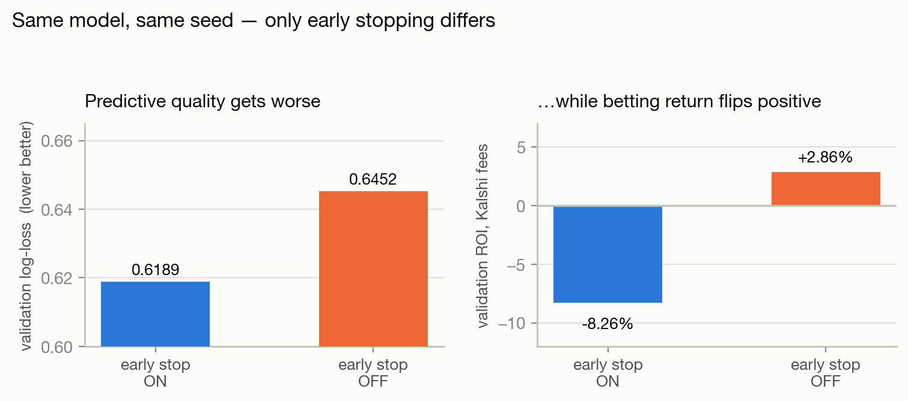
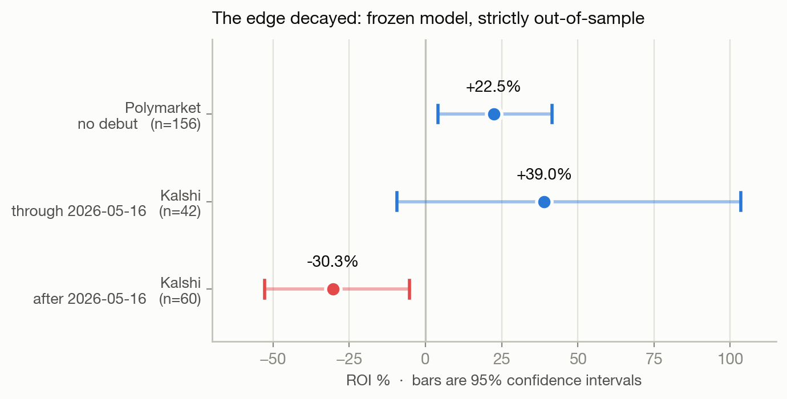
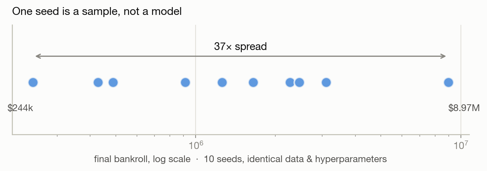

# UFC Fight Prediction — a calibrated betting model, and what it got wrong

[](https://github.com/jaimebernalm/ufc-betting-model/actions/workflows/ci.yml)
[](https://www.python.org/downloads/)
[](LICENSE)

A CatBoost + Bayesian-skill model that prices UFC fights against prediction
markets (Kalshi, Polymarket), sizes bets with fee-correct fractional Kelly, and
runs live as a notify-only watchdog.

On a held-out test set of **1,141 fights** it returned **+10.9% ROI**
(95% CI [+2.5%, +19.4%]) at flat stakes against real Kalshi fees — while being
*worse* than the market at actually predicting fights (log-loss 0.623 vs 0.582).

That gap is the whole point, and the honest version of this README is that the
edge later **decayed to −30%** on Kalshi after May 2026. Both halves are
documented below.

---

## The interesting result

The model loses to the closing line on every predictive metric:

| | log-loss ↓ | Brier ↓ | ECE ↓ | accuracy ↑ |
|---|---|---|---|---|
| **Model** | 0.623 | 0.216 | 0.063 | 65.6% |
| **Market (no-vig)** | **0.582** | **0.199** | **0.030** | **69.5%** |

And still beat it on money, because betting return does not reward being right
on average — it rewards being right *where the price is wrong*. Those are the
tails, and a log-loss-minimizing model trades exactly those away.

This drove the central methodological decision: **select on ROI, not log-loss**.
A clean A/B on the same model and seed, varying only early stopping:

| | val log-loss | val ECE | ROI (Kalshi-like) |
|---|---|---|---|
| early stopping **on** | **0.6189** | **0.0703** | −8.26% |
| early stopping **off** | 0.6452 | 0.1054 | **+2.86%** |



Turning it off makes the model worse on *every* predictive metric and flips
betting return positive. Early stopping tunes the tree count against validation
log-loss — the same set used to judge profit — and log-loss is anti-correlated
with profit here. Full reasoning in [docs/methodology.md](docs/methodology.md).

## What broke

A model frozen at 2025-11-30 and evaluated strictly forward:

| venue | window | bets | ROI | 95% CI |
|---|---|---|---|---|
| Polymarket | full, no debut | 156 | **+22.5%** | [+4.2, +41.5] |
| Kalshi | → 2026-05-16, no debut | 42 | **+39.0%** | [−9.4, +103.4] |
| Kalshi | 2026-05-16 →, no debut | 60 | **−30.3%** | [−52.8, −5.2] |



The post-May decline has a confidence interval excluding zero — it is not noise.
Contributing factors the audits could establish: market liquidity rose ~6×
(median Polymarket volume $59.6k → $354k), consistent with a maturing market
pricing out the inefficiency. Ruled out: an ask-vs-last-trade pricing artifact
(0 bet-eligibility changes across 63 fights).

Separately, **debut fights are a permanent failure mode** (−23% to −72% ROI). A
fighter with no UFC history has no skill posterior and no career features. They
are excluded at deployment.

Full numbers: [docs/results.md](docs/results.md).

---

## Quickstart

```bash
git clone https://github.com/jaimebernalm/ufc-betting-model.git
cd ufc-betting-model
python -m venv .venv && source .venv/bin/activate
pip install -e ".[dev]"
pytest                                  # 76 passed, 4 skipped (need the dataset)
```

Reproduce a rung of the model ladder (needs the data pipeline first — see
[docs/architecture.md](docs/architecture.md)):

```bash
python -m ufc_pred.models.baseline_v3      # single model + Bayesian skill
python -m ufc_pred.models.baseline_v7_1    # deployed 10-seed ensemble
```

Live commands (require Kalshi API credentials in `.env`; see `.env.example`):

```bash
ufc-preview      # read-only preview of the next card
ufc-predict      # score + size a full card
ufc-runner       # T-90min watchdog (notifies; never places orders)
```

## Methodology highlights

Each of these is a place where the obvious choice was wrong:

- **ROI over log-loss** — they pull in opposite directions; calibration
  sharpening that improves log-loss actively destroys betting return
- **Early stopping on validation is a leak** — it tunes tree count against the
  same set used to judge profit; later rungs train to a fixed iteration count
- **A single seed is not a model** — identical data and hyperparameters,
  varying only `random_seed`, produced final bankrolls from **$243k to $8.97M**
  (37× spread). Deployment averages 10 seeds

  

- **Ensembling is not universally good** — it helped the noisy architecture
  (+4.1% → +5.2%) and *hurt* the sharp one (+8.4% → +2.4%); ablated per model
- **Fee formulas verified from primary sources** — flat-% approximations were
  wrong by 5–20× near the extremes; the real Kalshi fee is quadratic,
  `0.07 × P × (1−P)` per contract, charged upfront
- **Frozen beats rolling** — across 8 strategies × 10 seeds × 3 accounts on two
  non-overlapping windows, a ~6-month-stale frozen model won median bankroll;
  rolling retrains never won

## Repository layout

```
src/ufc_pred/
├── ingest/       Kaggle, UFCStats scraper, Kalshi + Polymarket clients
├── features/     static · derived · Bayesian skill (walk-forward)
├── models/       ModelSpec + shared harness; one file per ladder rung
├── calibration/  isotonic, conformal
├── backtest/     fee-correct ROI, strategy grid, CLV
├── inference/    predict → fee-correct → ¼-Kelly → cap
├── ops/          bankroll reconciliation, fill capture
└── cli/          five console entry points
scripts/
├── research/     one-shot analyses, kept as a record
└── tools/        data pipeline + maintenance
docs/             methodology, results, architecture, deployment
tests/            80 tests (4 need the dataset)
```

## Deployment

Runs live against Kalshi as a launchd watchdog, ticking every 60 seconds and
capturing each fight when the previous one settles. Three virtual accounts run
in parallel at different Kelly fractions.

**It is notify-only.** `KalshiClient` exposes balance, market, and orderbook
reads — there is no order-placement method anywhere in the package. The system
computes a recommendation and pushes it to a phone; a human places every bet.
That is a deliberate constraint, not an unfinished feature.

Details: [docs/deployment.md](docs/deployment.md).

---

## Disclaimer

This is a research and educational project. **It is not financial advice and not
a betting service.**

Sports betting carries substantial risk of loss. The backtests here show an 84%
maximum drawdown at the deployed Kelly fraction, and the live edge measurably
decayed to negative on one venue. Historical performance does not predict future
results — this project contains direct evidence of exactly that.

No third-party data is redistributed. The Kaggle dataset and UFCStats data must
be fetched by the user, subject to those sources' own terms; the scraper is
rate-limited accordingly. Check that sports betting and prediction-market
trading are legal in your jurisdiction.

## License

[MIT](LICENSE)
